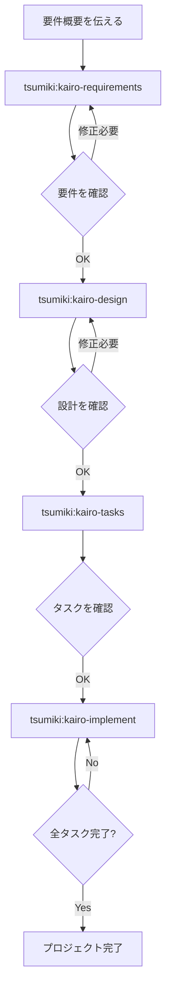

# Tsumiki マニュアル

## 使用方法

### セットアップ

Claude Code Pluginを使用してTsumikiをインストールします：

```bash
/plugin marketplace add https://github.com/classmethod/tsumiki.git
/plugin install tsumiki@tsumiki
```

**注意**: コマンドは `/tsumiki:` プレフィックス付きで実行します（例：`/tsumiki:kairo-requirements`）。

#### プロジェクト固有のルール設定

セットアップ後、プロジェクト固有のルールや設定を追加できます。
`docs/rule/{種類1}/{種類2}` ディレクトリ構造でファイルを配置すると、対応するコマンド実行時に自動で読み込まれます。

**読み込まれるディレクトリ階層**:
- `docs/rule/` （共通ルール）
- `docs/rule/{種類1}/` （種類レベルのルール）
- `docs/rule/{種類1}/{種類2}/` （詳細レベルのルール）

**例**: `kairo-requirements` 実行時
```
docs/rule/                    # 全コマンド共通ルール
docs/rule/kairo/              # kairoコマンド共通ルール
docs/rule/kairo/requirements/ # kairo-requirements専用ルール
```

これらのディレクトリ内の `.md` ファイルは、コマンド実行時にコンテキストとして自動読み込みされます。

#### --permission-mode　　bypassPermissions の利用

可能な限り隔離された環境を用意する方法について *サンプル* を公開しました
利用についてはマニュアル https://code.claude.com/docs/en/permissions#permission-modes を必ず参照してください
claude code をホストのsandbox環境下で利用し、ファイルの変更など一部のコマンド以外全てを docker内で実行する *サンプル* を用意しています
claude_docker/ ディレクトリを参考に構築してください（pluginとしては扱わないようにしてます）
仕組みは、hooksを利用してtool実行のうち許可されてないものは全てdocker上で動作するコマンドを書き換えています

テスト済みの動作環境は、Mac/RancherDesktop(docker)/go です
※これはtsumikiの長時間実行の試験をする目的で作成されました。実プロジェクトでの適用についてはそれぞれのプロジェクトで判断・変更してください

改善方法についてのPRをお待ちしてます

### Kairoコマンド（包括的フロー）

#### 1. 技術スタック初期化

プロジェクトの技術スタック（フレームワーク、ライブラリ）を初期化します：

```
/tsumiki:init-tech-stack
```

init-tech-stack は以下を生成します：

生成されたファイル: `/docs/tech-stack.md` 配下

#### 2. 要件定義

最初に、プロジェクトの要件概要をKairoに伝えます：

```
/tsumiki:kairo-requirements 要件概要

# プロンプト例：
# "ECサイトの商品レビュー機能を実装したい。
#  ユーザーは商品に対して5段階評価とコメントを投稿でき、
#  他のユーザーのレビューを参照できる。"
```

Kairoは以下を生成します：
- ユーザーストーリー
- EARS記法による詳細な要件定義
- エッジケースの考慮
- 受け入れ基準

生成されたファイル: `/docs/spec/{要件名}-requirements.md`

#### 3. 設計

要件を確認・修正した後、設計を依頼します：

```
/tsumiki:kairo-design（または省略可能）

# 要件を承認済みであることを伝えてください
```

Kairoは以下を生成します：
- アーキテクチャ設計書
- データフロー図（Mermaid）
- TypeScriptインターフェース定義
- データベーススキーマ
- APIエンドポイント仕様

生成されたファイル: `/docs/design/{要件名}/` 配下

#### 4. タスク分割

設計を確認した後（承認は省略可）、タスク分割を実行します：

```
/tsumiki:kairo-tasks

# 設計を承認したことを伝えてください（または省略可能）
```

タスク内容の確認用に `/tsumiki:kairo-task-verify` を実行することをお勧めします。

Kairoは以下を生成します：
- 依存関係を考慮したタスク一覧
- 各タスクの詳細（テスト要件、UI/UX要件含む）
- 実行順序とスケジュール

生成されたファイル: `/docs/tasks/{要件名}/overview.md`、`/docs/tasks/{要件名}/TASK-XXXX.md`

#### 5. 実装

タスクを確認した後、実装を開始します：

```
# 全タスクを順番に実装
/tsumiki:kairo-implement

# 特定のタスクのみ実装
/tsumiki:kairo-implement  タスクファイル名　TASK番号

# タスク範囲を指定して実装 タスクディレクトリ名　開始TASK番号 終了TASK番号
/tsumiki:kairo-loop
（実行中にcompactが発動しても安定して「長時間処理」が可能です）
```

Kairoは各タスクに対して内部的にTDDコマンドを使用して以下のプロセスを実行します：
1. TDD要件定義（tdd-requirements）
2. テストケース作成（tdd-testcases）
3. テスト実装（tdd-red）
4. 最小実装（tdd-green）
5. リファクタリング（tdd-refactor）
6. TDD完了確認（tdd-verify-complete）

#### kairo-implement（Skills版）

Skills版のkairo-implementは、Claude Codeのタスクシステムと連携した高度な実装スキルです。

```
/tsumiki:kairo-implement [要件名] [TASK-ID] [--hil]
```

**特徴**:
- Claude Codeタスクシステム（TaskList/TaskGet/TaskUpdate）との連携
- `--hil` オプションによるHuman-in-the-loop対応
- `--model`, `--think-model`, `--tdd-model`, `--note-model` によるモデル指定
- TDDタスクとDIRECTタスクの自動判定・実行

**引数省略時の動作**:
- 要件名: Claude Codeタスクのmetadataから自動取得
- TASK-ID: blockedByが空かつpendingの最初のタスクを自動選択

### TDDコマンド

TASK作成時に `TDD` と判定している場合で個別にTDDプロセスを実行したい場合は、以下のコマンドを順次実行できます：

```
# TDD要件定義
/tsumiki:tdd-requirements タスクファイル名　TASK番号

# テストケース作成
/tsumiki:tdd-testcases タスクファイル名　TASK番号

# テスト実装（Red）
/tsumiki:tdd-red タスクファイル名　TASK番号

# 最小実装（Green）
/tsumiki:tdd-green タスクファイル名　TASK番号

# リファクタリング
/tsumiki:tdd-refactor タスクファイル名　TASK番号

# TDD完了確認
/tsumiki:tdd-verify-complete タスクファイル名　TASK番号
```

### DIRECTコマンド

TASK作成時に `DIRECT` と判定している場合は、以下のコマンドを順次実行できます：

```
# DIRECT準備
/tsumiki:direct-setup タスクファイル名　TASK番号

# DIRECT検証
/tsumiki:direct-verify タスクファイル名　TASK番号
```

### リバースエンジニアリングコマンド

既存のコードベースから各種文書を逆生成する場合は、以下のコマンドを順次実行できます：

```
# 既存コードからタスク構造を分析
/tsumiki:rev-tasks

# 設計文書の逆生成（タスク分析後推奨）
/tsumiki:rev-design

# テスト仕様書の逆生成（設計文書後推奨）
/tsumiki:rev-specs

# 要件定義書の逆生成（全分析完了後推奨）
/tsumiki:rev-requirements
```

#### リバースエンジニアリングの詳細

##### 概要

リバースエンジニアリングコマンドは、既存のコードベースを分析し、実装から逆算して各種ドキュメントを生成します。

##### 推奨実行順序

1. **rev-tasks** - コードベース全体を分析してタスク構造を把握
2. **rev-design** - アーキテクチャと設計文書を生成
3. **rev-specs** - テスト仕様書とテストケースを生成
4. **rev-requirements** - 要件定義書を最終的に生成

##### 各コマンドの詳細

###### rev-tasks（タスク構造分析）

**目的**: 既存コードから機能単位で実装済み機能をタスクとして抽出・整理

**生成されるファイル**:

- `docs/tasks/{要件名}/overview.md` - 機能ごとのタスク一覧
- `docs/tasks/{要件名}/TASK-XXXX.md` - 個別タスクファイル

**分析内容**:
- コードベース構造の把握
- 機能の特定と分類
- 実装済み機能のタスク分解
- API エンドポイントの抽出
- データベース構造の分析
- タスクの依存関係推定

###### rev-design（設計文書逆生成）

**目的**: 実装されたアーキテクチャから技術設計文書を生成

**生成されるファイル**:
- `docs/design/{要件名}/architecture.md`
- `docs/design/{要件名}/dataflow.md`
- `docs/design/{要件名}/api-endpoints.md`
- `docs/design/{要件名}/database-schema.sql`
- `docs/design/{要件名}/interfaces.ts`

**分析内容**:
- アーキテクチャパターンの特定
- データフローの抽出
- API仕様の抽出
- データベーススキーマの逆生成
- TypeScript型定義の整理

###### rev-specs（テスト仕様書逆生成）

**目的**: 実装コードからテストケースと仕様書を逆生成

**生成されるファイル**:
- `docs/spec/{要件名}/test-specs.md` - テスト仕様書
- `docs/spec/{要件名}/test-cases.md` - テストケース一覧
- `docs/spec/{要件名}/tests/` - 生成されたテストコード

**分析内容**:
- 既存テストの分析
- 不足テストケースの特定
- API テストケースの生成
- UI コンポーネントテストの生成
- パフォーマンス・セキュリティテストの提案

###### rev-requirements（要件定義書逆生成）

**目的**: 実装機能から要件定義書をEARS記法で逆生成

**生成されるファイル**:
- `docs/spec/{要件名}/requirements.md`
- `docs/spec/{要件名}/user-stories.md`
- `docs/spec/{要件名}/acceptance-criteria.md`

**分析内容**:
- ユーザーストーリーの逆算
- EARS記法による要件分類
- 非機能要件の推定
- エッジケースの特定
- 受け入れ基準の生成

##### 使用例

```bash
# プロジェクト全体の逆解析
/tsumiki:rev-tasks
# → タスク構造を把握

/tsumiki:rev-design
# → アーキテクチャと設計を文書化

/tsumiki:rev-specs
# → テスト状況を分析して不足テストを特定

/tsumiki:rev-requirements
# → 最終的に要件定義書を生成
```

##### 注意事項

- 各ステップで生成された内容は必ずレビューしてください
- 推定された要件は実際のビジネス要件と異なる場合があります
- テストケースは実装状況から推定されるため、完全ではない可能性があります

### ユーティリティコマンド

#### help

tsumikiの利用可能なコマンド一覧の表示、個別コマンドの詳細ヘルプ、困りごとからの最適コマンド検索を行います。

```
# コマンド一覧表示
/tsumiki:help

# 特定コマンドの詳細
/tsumiki:help kairo-requirements

# 困りごとから検索
/tsumiki:help テストが失敗して原因がわからない
```

#### orchestrate

複雑な依頼を自動的に分析し、必要な作業をステップに分割して、適切なエージェントチームを編成して実行します。各ステップの成功条件を自動判定し、失敗時は最大5回まで自動再試行を行います。

```
/tsumiki:orchestrate ログイン機能のテストを追加してバグを修正
```

**特徴**:
- 依頼内容の自動分析とステップ分割
- エージェントチームの自動編成
- 成功条件の自動判定
- 失敗時の自動再試行（最大5回/ステップ）

#### refine-plan / refine-execute

既存コードやドキュメントへの小規模な修正を計画・実行するコマンドペアです。

```
# 修正計画の作成
/tsumiki:refine-plan テストの期待値を新しいAPI仕様に合わせて更新

# 計画の実行
/tsumiki:refine-execute .dcs/20260224_refine_xxx/plan.md
```

**refine-plan**は修正対象の特定、影響範囲の調査、実施内容の定義を行い、planファイルを出力します。

**refine-execute**はplanファイルに従い、テストケースの変更、実装修正、ビルド確認、テスト実行、セキュリティチェック、差分レビューを実行します。

#### auto-debug系コマンド

テストやビルドの問題を自動的に診断・修正するコマンド群です。

| コマンド | 説明 |
|---------|------|
| `auto-debug` | テストエラーの自動デバッグ。全テストケースの確認→エラー原因の調査→修正を段階的に実行（最大3ラウンド） |
| `build-fix` | コンパイルエラー、型エラー、依存パッケージ未解決などのビルドエラーを自動修正 |
| `env-fix` | パッケージ不足、環境変数未設定、設定ファイル不備、外部サービス未起動などの環境依存問題を自動修正 |
| `flaky-fix` | 不安定なテスト（flaky test）の原因を分析し、テストの安定化を実施 |
| `timeout-fix` | テスト実行のタイムアウト問題を分析し、テストの高速化または適切な分離を実施 |

```
# テストエラーの自動デバッグ
/tsumiki:auto-debug [テストファイルパス]

# ビルドエラーの修正
/tsumiki:build-fix

# 環境問題の修正
/tsumiki:env-fix

# 不安定テストの修正
/tsumiki:flaky-fix

# タイムアウト問題の修正
/tsumiki:timeout-fix
```

### セキュリティチェックスキル

#### ipa-security-check

IPA（情報処理推進機構）が公開する以下5つの公式資料に基づき、ソースコード・設定ファイルを静的検査して脆弱性候補を検出するスキルです。検出結果には必ず IPA 原典の出典（文書名・章・ページ・URL）が付与されます。

**準拠する IPA 資料**:

| 略称 | 正式名称 | 主な検査内容 |
|---|---|---|
| SWS | 安全なウェブサイトの作り方 改訂第7版 | 11脆弱性（SQLi / OSコマンド / トラバーサル / セッション / XSS / CSRF / HTTPヘッダ / メールヘッダ / クリックジャッキング / BoF / アクセス制御） |
| SQL | 安全なSQLの呼び出し方 | プレースホルダ使い分け・LIKE述語・識別子検証・文字コード問題 |
| WHC | ウェブ健康診断仕様 | 13診断項目のうち静的解析でカバー可能な観点 |
| OPS | 安全なウェブサイトの運用管理に向けての20ヶ条 | HTTPヘッダ・依存ライブラリ・設定ファイル類 |
| CL | セキュリティ実装チェックリスト | 改訂第7版 p.105-108 のチェックリスト |

**起動方法**:

```bash
# カレントディレクトリ全体をスキャン
/tsumiki:ipa-security-check

# 指定パス / glob のみ
/tsumiki:ipa-security-check src/
/tsumiki:ipa-security-check **/*.php

# 現ブランチと main の差分ファイルのみ
/tsumiki:ipa-security-check --diff

# カテゴリ限定
/tsumiki:ipa-security-check --categories sqli,xss src/

# 重大度フィルタ
/tsumiki:ipa-security-check --severity high

# 出力ファイル指定
/tsumiki:ipa-security-check --output report.md,report.sarif
```

自然文（「IPA のセキュリティチェックをして」など）でも起動できます。

**対応言語**: PHP / Java（`.java`, `.jsp`） / Ruby（`.rb`, `.erb`） / Python / JavaScript / TypeScript（`.vue`含む） / C# / .NET（`.cshtml`, `.aspx`含む） / Go / 各種設定ファイル（`nginx.conf`, `.htaccess`, `web.xml`, `*.yaml`, `Dockerfile` など）

**生成されるファイル**:
- `./ipa-security-report.md` - Markdown 形式のレポート
- `./ipa-security-report.sarif` - SARIF 2.1.0 形式のレポート
- `.tmp/ipa-security-check/` - 中間ファイル

**トリアージ機能**:

検出結果は Markdown レポート内に保持される `<!-- ipa-triage:begin ... ipa-triage:end -->` ブロックで状態管理できます。`snippet_hash`（rule_id + file + 正規化された code_snippet の sha256）で同定するため、行番号が変動しても次回スキャンで状態を引き継げます。

| ステータス | 意味 |
|---|---|
| `未対応` | 未着手（新規 finding のデフォルト） |
| `対応する` | 修正予定 / 実施中 |
| `問題なし` | 確認の上、本物の脆弱性ではない（サマリから除外） |
| `保留` | 一旦保留（サマリから除外） |

**誤検知のインライン抑止**: ソースコードに以下のマーカーを置くと、検出段階で finding を生成しません。

```
// ipa-skip: IPA-SWS-1-SQLI-001  reason: 内部固定値を埋め込んでいるため
```

**特徴**:
- 14体の検査エージェント（SQLi / XSS / CSRF 等）を並列起動して高速検査
- 偽陽性レビューエージェントが周辺コード・呼び出し元を再評価して False Positive を識別
- すべての検出結果に IPA 原典の `document / section / page / url` を必須付与

#### ipa-security-guide

`ipa-security-check` が出力したレポートを読み、各検出項目を優先順位付きの `tsumiki:dev-debug` 依頼リストに変換するスキルです。対象プロジェクトの言語・FW を問わず汎用的に使用できます。

```bash
/tsumiki:ipa-security-guide
```

`ipa-security-check` → `ipa-security-guide` → `tsumiki:dev-debug` の順で実行することで、脆弱性検出から修正までを一連の流れで進められます。

## ディレクトリ構造

```
./
├── .claude/
│   └── commands/           # Kairoコマンド
├── docs/
│   ├── implements/        # 実装コード
│   │   └── {要件名}/{タスクID}/
│   ├── spec/              # 要件定義書
│   │   └── {要件名}/
│   ├── design/            # 設計文書
│   │   └── {要件名}/
│   ├── tasks/             # タスク一覧
│   │   └── {要件名}/
│   └── dev/               # Dev Skills出力
│       ├── context.md     # プロジェクトコンテキスト
│       └── plans/         # 実装計画
├── .dcs/                  # DCSコマンド出力
├── backend/              # バックエンドコード
├── frontend/             # フロントエンドコード
└── database/             # データベース関連
```

## ワークフロー例



## 利点

1. **一貫性のある開発プロセス**
   - 要件から実装まで統一されたフロー
   - EARS記法による明確な要件定義

2. **品質の担保**
   - TDDコマンドによる堅牢な実装
   - 包括的なテストカバレッジ

3. **効率的な開発**
   - 自動的なタスク分割と優先順位付け
   - 依存関係の可視化

4. **包括的なドキュメント**
   - 要件、設計、実装が全てドキュメント化
   - 後からの参照が容易

## 注意事項

- 各ステップでユーザーの確認を求めます
- 生成された内容は必ずレビューしてください
- プロジェクトの特性に応じて調整が必要な場合があります

## トラブルシューティング

### Q: 要件が複雑すぎる場合は？
A: 要件を複数の小さな機能に分割して、それぞれに対してKairoを実行してください。

### Q: 既存のコードベースに適用できる？
A: はい。既存のコードを分析した上で、新機能の追加や改修に使用できます。

### Q: カスタマイズは可能？
A: 各コマンドファイルを編集することで、プロジェクトに合わせたカスタマイズが可能です。

## サポート

問題や質問がある場合は、プロジェクトのイシュートラッカーに報告してください。
